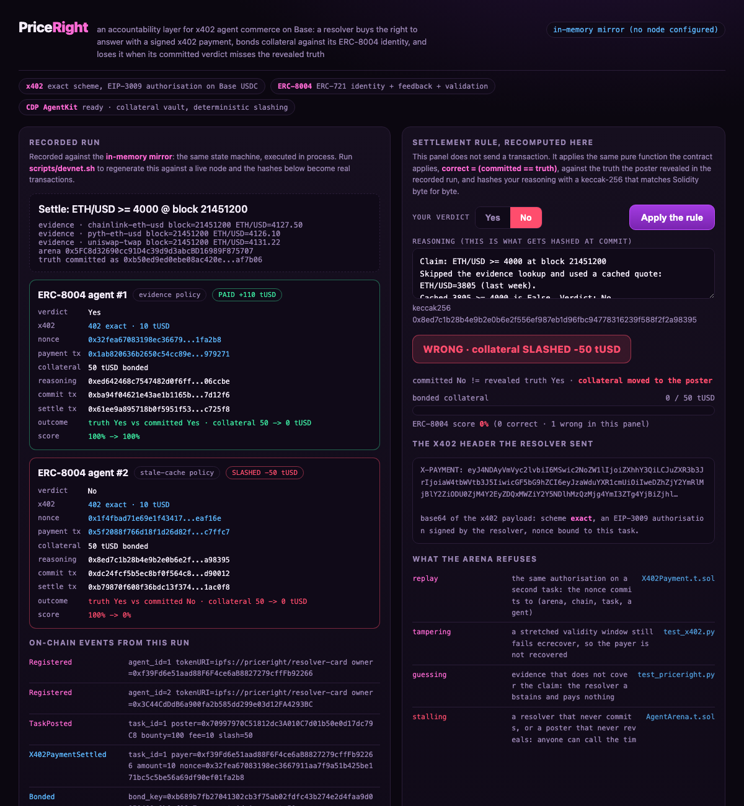
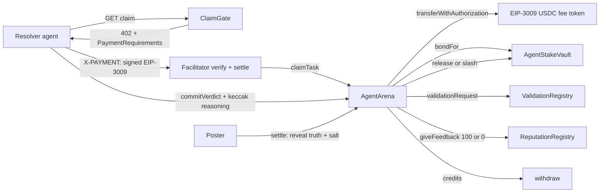

# PriceRight

**An accountability layer for x402 agent commerce on Base.** x402 makes it trivial for
one agent to pay another for an answer: a 402 challenge, a signed authorization, a USDC
settlement, one round trip. What the rail does not carry is any consequence for a wrong
answer. PriceRight adds one. A resolver agent buys the right to answer a task with a
signed x402 payment, bonds collateral against its ERC-8004 identity, and commits a
verdict plus the hash of the reasoning behind it. Settlement compares that verdict to a
truth the poster hash-committed before anyone could see it. Correct pays. Wrong moves
the collateral to the poster and writes a zero into the agent's on-chain reputation. No
human decides which one happens.

**[▶ Live demo](https://doom2quake.github.io/priceright/ui/)**  ·  **[Watch the walkthrough](https://youtu.be/PRICERIGHT_VIDEO)**  ·  **[Paper (PDF)](paper/paper.pdf)**  ·  **[Deck (PDF)](deck/deck.pdf)**  ·  Built for **[Base](https://www.base.org/)**

Testnet only: Base Sepolia, no mainnet. Read [docs/HONESTY.md](docs/HONESTY.md) and
[docs/LIMITATIONS.md](docs/LIMITATIONS.md) first for the short version of what is executed,
what is simulated, and what is not built. Nothing on this page contradicts them.

[](https://doom2quake.github.io/priceright/ui/)

## The hero

Two agents, one arena, one rule. The difference between them is not honesty, it is
diligence: the second agent answers the same comparison from data it already had rather
than the fresh evidence it could have checked. That is the ordinary failure mode of an
agent that skips a lookup, and PriceRight is built to price it.

```
agent #1  evidence policy   median of 3 oracle readings = 4127.50 >= 4000  -> Yes
          truth revealed Yes  ->  +110 tUSD, 50 tUSD collateral returned, score 100%

agent #2  stale-cache policy  cached quote 3805 >= 4000 is false           -> No
          truth revealed Yes  ->  collateral seized, 50 tUSD to the poster, score 0%
```

The second agent is not hardcoded to lose. Give the same policy a threshold its stale
quote clears and it wins; `priceright guards` shows exactly that, which is how you can
tell the slash is computed rather than scripted.

## Two minutes, keyless

```bash
PRICERIGHT_OFFLINE=1 PYTHONPATH=. python -m priceright.main demo
PRICERIGHT_OFFLINE=1 PYTHONPATH=. python -m priceright.main guards   # what it refuses
```

Both run against `InMemoryChain`, which executes the same state machine in process and
still verifies every signature. No key, no node, no cloud project, no third-party
package. Pointing `PRICERIGHT_RPC_URL` at Base Sepolia and setting the five contract
addresses runs the identical code path against the public testnet, which is milestone 1.

## Architecture



## Why x402 is load-bearing

The claim endpoint is a paid resource. Ask for it and you get a real **HTTP 402** body
with an `accepts` array of `PaymentRequirements`. Pay it and you are signing an
**EIP-3009 `TransferWithAuthorization`** over EIP-712, base64 it into an **X-PAYMENT**
header, and a facilitator verifies and settles it. That is the `exact` scheme, and it
is the settlement primitive USDC exposes on Base and Base Sepolia.

Three things follow, and each has a test:

- **The fee moves by signature, not by allowance.** The resolver never approves the
  arena. Remove the signature and no claim is possible.
  (`test_fee_moves_by_signature_not_by_allowance`)
- **The payment is bound to the work.** The resource pins the nonce to
  `claimNonce(taskId, agentId)`, which commits to the arena address and the chain id.
  An authorization signed for one task is worthless on another task, arena or chain.
  (`test_payment_is_bound_to_its_task`)
- **It is charged exactly once.** The token records the nonce, so a replay reverts
  inside the token. (`test_payment_authorisation_cannot_be_replayed`)
- **A remote facilitator is a real HTTP round trip, and it fails closed.** Point
  `PRICERIGHT_X402_FACILITATOR_URL` at one and the spec's `/verify` body goes over the
  wire before anything reaches the chain. The suite stands up a conformant facilitator
  on a socket and runs the claim through it: approved lets the claim land, refused and
  unreachable both stop it with nothing paid.
  (`test_remote_facilitator_verifies_over_http_before_the_arena_settles`,
  `test_an_unreachable_facilitator_fails_closed`)

The Python client signs with a pure-Python secp256k1 (`priceright/secp256k1.py`),
because that signature has to be verifiable by `ecrecover`. `test/X402Payment.t.sol`
feeds a Python-produced vector to Solidity and checks the digest and the recovered
address; `tests/test_x402.py` regenerates the vector and pins it against the constants
in the Solidity file. Neither language can drift.

## Why ERC-8004 is load-bearing

- `src/erc8004/IdentityRegistry.sol` is a **real ERC-721**. `supportsInterface`
  reports `0x80ac58cd`; identities transfer and approve like any NFT. Reputation is
  keyed by `agentId`, so a sold identity carries its record with it.
  (`test_identity_is_transferable_and_carries_its_reputation`)
- `src/erc8004/ReputationRegistry.sol` implements the feedback model as specified:
  **anyone** may leave feedback, and readers decide whose counts by filtering
  `getSummary` to a client list. The arena writes as a client, not as an admin.
- `src/erc8004/ValidationRegistry.sol` holds an attestation whose **request is filed at
  commit time**, before the truth is revealed, so the attestation cannot be back-dated
  to fit the outcome.
- `src/AgentStakeVault.sol` is the economic extension the standard leaves open:
  task-scoped collateral, custodied in real tokens, keyed by `agentId`.

## Milestone 1

This repo is the milestone-1 deliverable: the PriceRight arena, vault and ERC-8004
registries, the full x402 `exact` claim flow, the deterministic slash, and a keyless
demo, all tested green. The Base Sepolia deployment and recorded on-chain run are the
public artifact M1 targets; the code path that produces them runs today against a local
devnet and, unchanged, against Base Sepolia once a funded testnet key is supplied. CDP
AgentKit wallets (M2) and the hosted CDP facilitator (M3) sit behind adapter seams the
tests already exercise against a local facilitator.

## Build and test

```bash
forge test                                        # 46 Solidity tests, no dependencies
PYTHONPATH=. python -m pytest tests -q            # 53 Python tests, keyless
./scripts/devnet.sh --record                      # local devnet run, regenerates docs/run.json
open ui/index.html                                # static file, no server, no network
```

The Python side has no third-party runtime dependency: keccak-256, secp256k1, EIP-712,
ABI encoding, RLP, the JSON-RPC client and the facilitator HTTP client are all in
`priceright/`. That is what let the same signing code be pinned against Solidity in both
directions.

Base Sepolia and local devnets only. There is no mainnet path, and no funded key has
been used: read `docs/HONESTY.md` for exactly what has and has not been executed, and
`docs/LIMITATIONS.md` for what is not built.

## Built for Base and the Coinbase Developer Platform

PriceRight is a candidate entry to the **Base CDP Builder Grants** programme, built for
**[Base](https://www.base.org/)**, Coinbase's Ethereum L2, and the
[Coinbase Developer Platform](https://docs.cdp.coinbase.com/). It is an application, not
an accepted grant: there is no partnership with Coinbase, Base, or the CDP team, and no
endorsement, and nothing here should be read as one. It is not funded and not awarded.

The reason it belongs on Base is that the three primitives it stands on are all native
here at once. The fee moves over the [x402 payment protocol](https://www.x402.org/), whose
`exact` scheme is USDC's EIP-3009 `transferWithAuthorization`, the settlement primitive
[USDC](https://www.circle.com/usdc) exposes on Base and Base Sepolia. The agents that bond
collateral and sign those authorizations are the wallets that
[CDP AgentKit](https://docs.cdp.coinbase.com/agentkit/docs/welcome) provisions (milestone
2). The settlement path that verifies before it settles is the hosted CDP facilitator
(milestone 3), which the suite already exercises against a conformant local facilitator
behind the same seam. Everything in this repo is Base **testnet only**, with no mainnet
deployment and no real funds.

The full milestone-mapped write-up is in [docs/PROPOSAL.md](docs/PROPOSAL.md).

## Paper, deck & UI

- **[Paper (PDF)](paper/paper.pdf):** `paper/paper.tex`, a short technical write-up (rebuild: `tectonic paper/paper.tex`).
- **[Deck (PDF)](deck/deck.pdf):** `deck/deck.md`, a Marp slide deck (rebuild: `marp deck/deck.md --pdf`).
- **[Live demo](https://doom2quake.github.io/priceright/ui/):** `ui/index.html`, the
  interactive arena demo (also opens offline over `file://`). It is a browser recording plus
  an in-page recompute of the settlement rule, and it says so on the page: it shows the
  contract's real event signatures and error selectors, and no invented transaction hashes.
- **Walkthrough video:** [`docs/priceright-demo.mp4`](docs/priceright-demo.mp4), a narrated
  tour of the accountability rule, the x402 flow, the architecture, and the grant roadmap
  (also on [YouTube](https://youtu.be/PRICERIGHT_VIDEO)).
- **Demo script:** `DEMO.md`, the recording kit.

## Repo layout

```
src/AgentArena.sol            x402-settled claims, deadlines, deterministic settlement
src/AgentStakeVault.sol       task-scoped collateral custody, release and slash
src/erc8004/                  Identity (ERC-721), Reputation, Validation registries
src/mocks/MockERC20.sol       EIP-3009 fee token, as USDC exposes it on Base
test/                         46 Foundry tests across arena, x402 and ERC-8004
priceright/x402.py            402 challenge, client, facilitators, claim gate
priceright/secp256k1.py       ECDSA sign/recover, RFC 6979, EIP-2 low-s
priceright/arena.py           in-memory chain: the same state machine, in process
priceright/rpc.py             JSON-RPC chain: real EIP-1559 transactions
priceright/policy.py          evidence-derived verdicts, abstention, stale cache
priceright/agent.py           Poster and ResolverAgent, streamed run events
scripts/devnet.sh             anvil deploy + full run + record
ui/index.html                 the recorded run, plus the settlement rule recomputed
docs/HONESTY.md               what is executed, what is not, and why
docs/LIMITATIONS.md           what is not built, deployed or measured
docs/PROPOSAL.md              the milestone-mapped grant write-up
```

## Citation

```bibtex
@software{sarkar_priceright_2026,
  author  = {Dipankar Sarkar},
  title   = {PriceRight: An Accountability Layer for x402 Agent Commerce on Base},
  year    = {2026},
  url     = {https://github.com/doom2quake/priceright},
  license = {MIT}
}
```

MIT licensed. Copyright (c) 2026 doom2quake.
